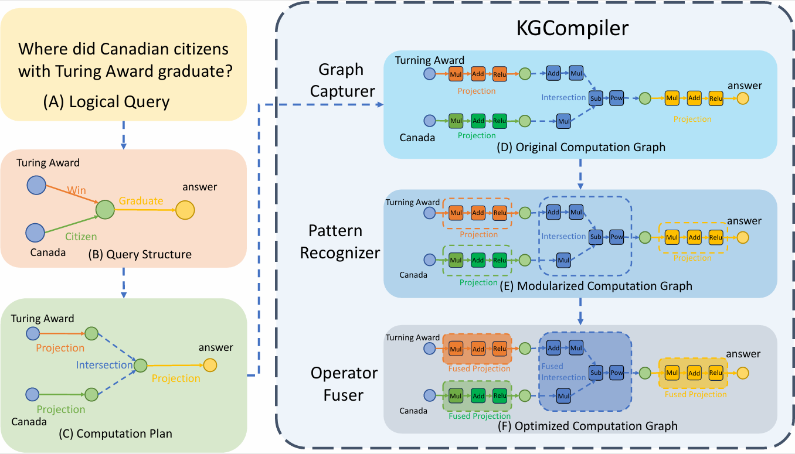
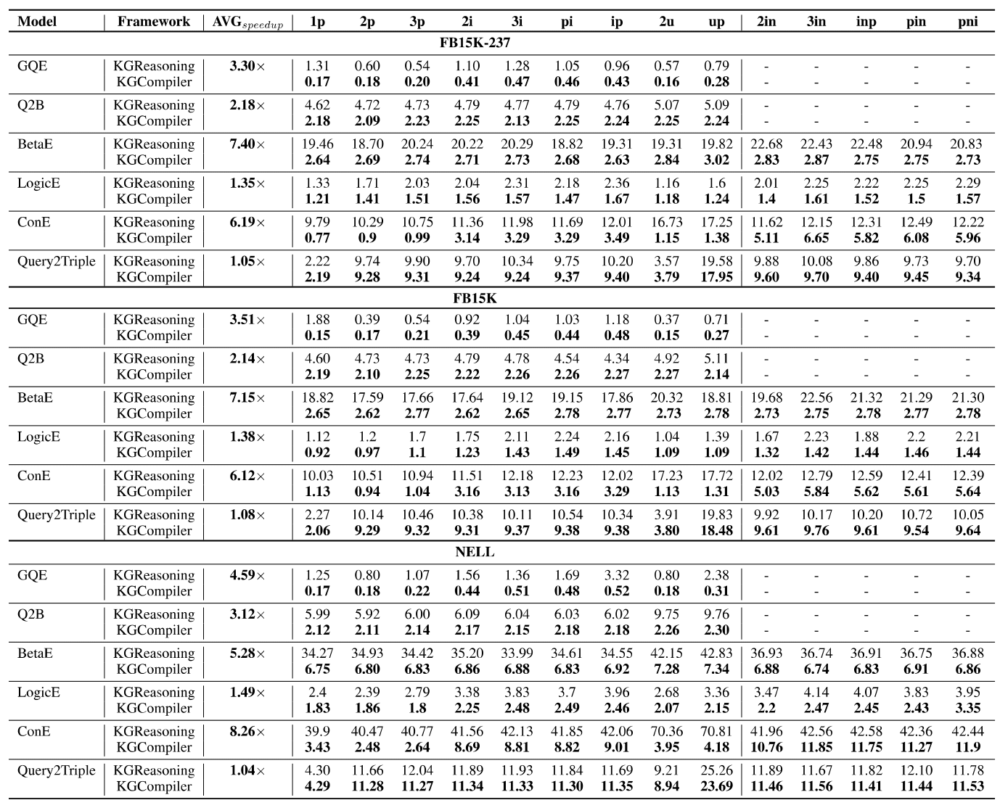

# KGCompiler: Deep Learning Compilation Optimization for Knowledge Graph Complex Logical Query Answering

## Introduction
**KGCompiler** is an compiler tailored for Complex Logical Query Answering (CLQA) on Knowledge Graphs (KGs). It optimizes reasoning performance and reduces memory usage for CLQA tasks without requiring manual modifications to existing algorithms. By leveraging KG-specific compilation strategies, KGCompiler accelerates multi-hop logical reasoning over large-scale KGs, achieving significant speedups while maintaining accuracy.

## Key Features
KGCompiler consists of three core components:
1. **Graph Capturer**

    Converts KG models and First-Order Logic (FOL) queries into computation graphs.

    Maps entities, variables, and logical operators (∧, ∨, ¬, ∃) to nodes and edges in the graph.

2. **Pattern Recognizer**

    Automatically detects FOL operator combinations (e.g., projection, intersection, negation).

    Decomposes complex operators into primitive deep learning operations (e.g., MLP, matrix multiplication).

3. **Operator Fuser**

    Applies horizontal, vertical, and hybrid fusion strategies to merge operators:

    Horizontal Fusion: Merges sequential operators (e.g., 2p, 3p).

    Vertical Fusion: Optimizes cross-path operators (e.g., 2i, 3i).

    Hybrid Fusion: Balances local and global optimizations (e.g., pin, pni).

## Main Results

The following table shows that KGCompiler improves the reasoning performance of all six KG models across 14 CLQA tasks at a batch size of 1, achieving up to 8.26× relative improvement over KGReasoning, with average improvements of 3.58×, 3.23×, and 3.96× on FB15K-237, FB15K, and NELL, respectively. 

