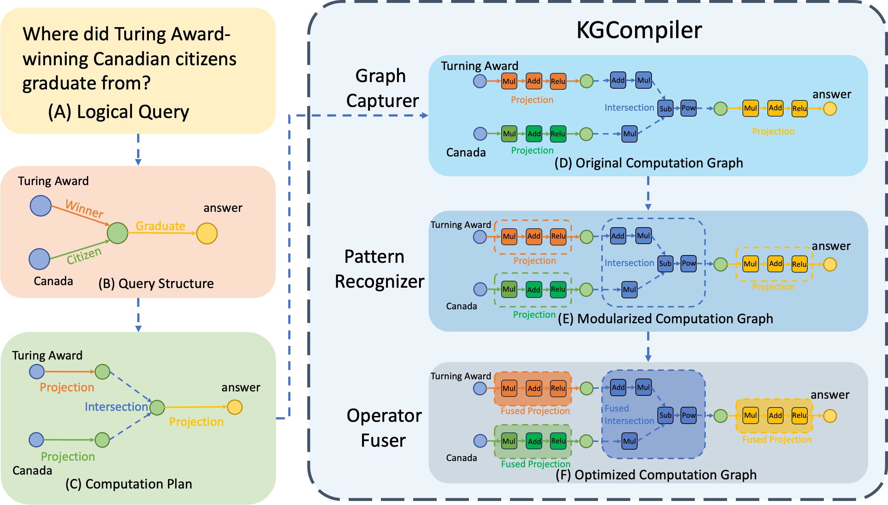
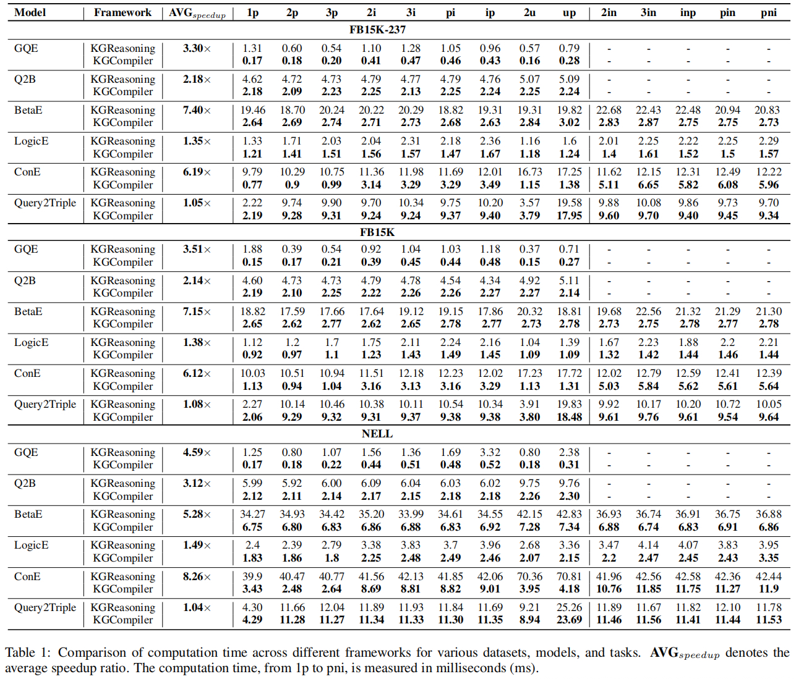
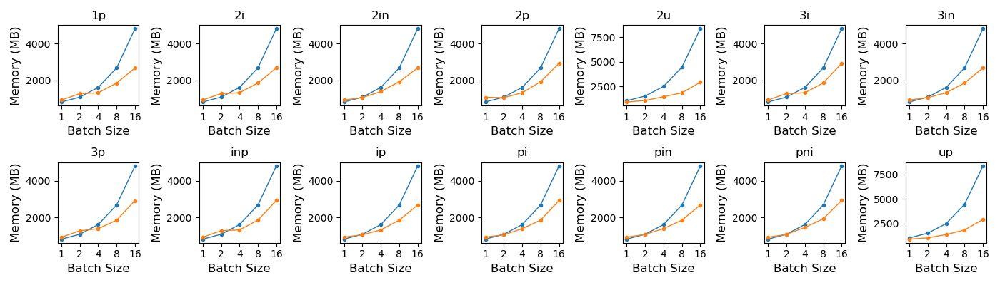

# KGCompiler

[](LICENSE)
[](https://www.python.org/downloads/)
[](https://pytorch.org/)

Official resources of **"KGCompiler: Deep Learning Compilation Optimization for Knowledge Graph Complex Logical Query Answering"**. [Hongyu Lin](https://arxiv.org/search/cs?searchtype=author&query=Lin,+H), [Haoran Luo](https://arxiv.org/search/cs?searchtype=author&query=Luo,+H), [Hanghang Cao](https://arxiv.org/search/cs?searchtype=author&query=Cao,+H), [Yang Liu](https://arxiv.org/search/cs?searchtype=author&query=Liu,+Y), [Shihao Gao](https://arxiv.org/search/cs?searchtype=author&query=Gao,+S), [Kaichun Yao](https://arxiv.org/search/cs?searchtype=author&query=Yao,+K), [Libo Zhang](https://arxiv.org/search/cs?searchtype=author&query=Zhang,+L), [Mingjie Xing](https://arxiv.org/search/cs?searchtype=author&query=Xing,+M), [Yanjun Wu](https://arxiv.org/search/cs?searchtype=author&query=Wu,+Y). [[paper](https://arxiv.org/abs/2503.02172)]

---

## 🔍 Overview

**KGCompiler** (**K**nowledge **G**raph **Compiler**) is the first knowledge graph-oriented deep learning compiler designed to optimize Complex Logical Query Answering (CLQA) tasks. By introducing KG-specific compilation optimizations, it achieves **average 3.71× speedup** and significant memory reduction for state-of-the-art KG models without compromising accuracy.

KGCompiler addresses three key challenges in CLQA:

1. **Semantic Gap Between Logical Operators and Hardware Execution Paradigms**
2. **Dynamic Query Structures Defy Static Optimization**
3. **Tight Coupling of Embedding Methods and Optimization Rules**

Through three core components:
- **Graph Capturer**: Converts KG models to computation graphs
- **Pattern Recognizer**: Detects FOL operator combinations
- **Operator Fuser**: Applies KG-specific fusion strategies



---

## 🚀 Quick Start

### Installation
```bash
git clone https://github.com/LHY-24/KGCompiler.git
cd KGCompiler
pip install -r requirements.txt
```

### Basic Usage
```python
from src.graph_capturer import GraphCapturer
from src.operator_fuser import OperatorFuser

# 1. Convert FOL query to computation graph
query = "∃v: Winner(TuringAward, v) ∧ Citizen(Canada, v) ∧ Graduate(v, ?)"
graph = GraphCapturer().capture(query)

# 2. Apply KGCompiler optimizations
optimized_graph = OperatorFuser().fuse(graph)

# 3. Execute on supported models (e.g., BetaE)
from src.models.betae import BetaE
model = BetaE(dataset="fb15k-237")
results = model.execute(optimized_graph)
```

---

## 📊 Performance

### Speedup Comparison (Batch Size = 1)
| Model     | Avg Speedup | Max Speedup |
|-----------|------------|------------|
| BetaE     | 7.40×      | 22.68×     |
| ConE      | 6.19×      | 17.25×     |
| Query2Triple | 1.04×    | 19.58×     |



### Memory Reduction


---

## 🧩 Supported Features

### Datasets
- FB15K
- FB15K-237  
- NELL

### CLQA Algorithms
| Algorithm | EPFO | Negation |
|-----------|------|----------|
| GQE       | ✅   | ❌       |
| Q2B       | ✅   | ❌       |
| BetaE     | ✅   | ✅       |
| LogicE    | ✅   | ✅       |
| ConE      | ✅   | ✅       |
| Query2Triple | ✅ | ✅       |

### Query Types
- **EPFO**: `1p`, `2p`, `3p`, `2i`, `3i`, `pi`, `ip`, `2u`, `up`
- **Negation**: `2in`, `3in`, `inp`, `pin`, `pni`

---

## 🛠 Customization

### Add New Fusion Strategy
```python
from src.operator_fuser import FusionStrategy

class CustomFusion(FusionStrategy):
    def match_pattern(self, graph):
        # Implement your pattern detection logic
        pass
    
    def fuse(self, graph):
        # Implement fusion optimization
        return optimized_graph

OperatorFuser.register_strategy(CustomFusion())
```

### Extend to New Model
1. Implement model in `src/models/`
2. Add pattern recognition rules in `src/pattern_recognizer.py`

---

## 📧 Contact
Contributions and feedback are greatly appreciated! Whether you've found a bug, have a question, or want to suggest improvements, please open an issue. Your input helps make BYOS better for everyone.

For further questions, please contact: [hongyu2021@iscas.ac.cn](mailto:hongyu2021@iscas.ac.cn), [luohaoran@bupt.edu.cn](mailto:luohaoran@bupt.edu.cn).

---

## 📄**Citation**

> ```bibtex
> @misc{lin2025kgcompilerdeeplearningcompilation,
>       title={KGCompiler: Deep Learning Compilation Optimization for Knowledge Graph Complex Logical Query Answering}, 
>       author={Hongyu Lin and Haoran Luo and Hanghang Cao and Yang Liu and Shihao Gao and Kaichun Yao and Libo Zhang and Mingjie Xing and Yanjun Wu},
>       year={2025},
>       eprint={2503.02172},
>       archivePrefix={arXiv},
>       primaryClass={cs.AI},
>       url={https://arxiv.org/abs/2503.02172}, 
> }
> ```